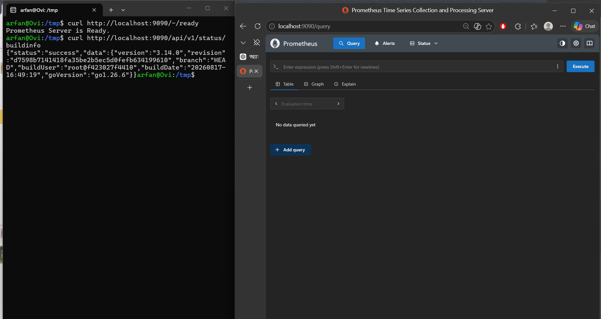
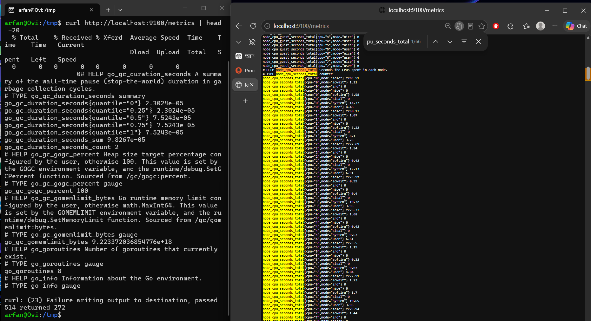
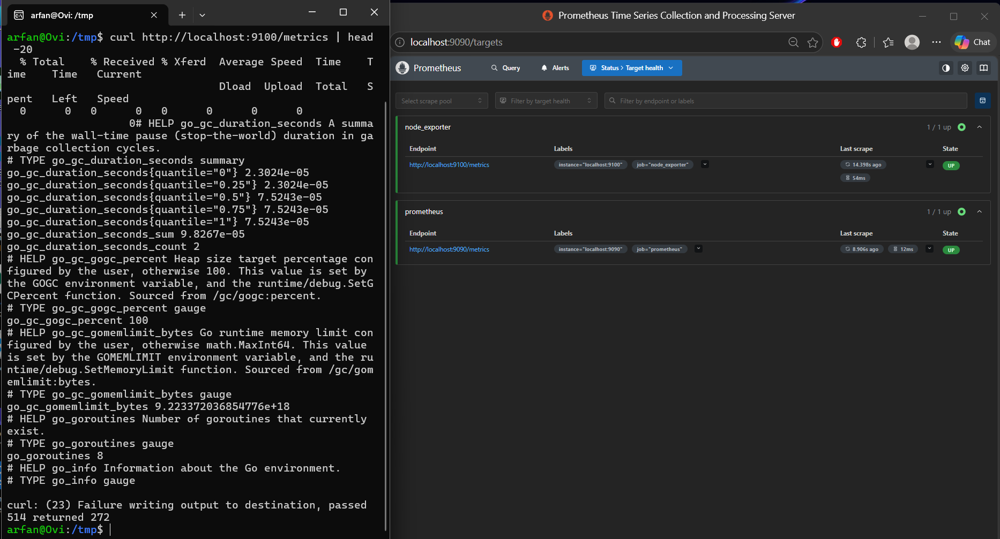
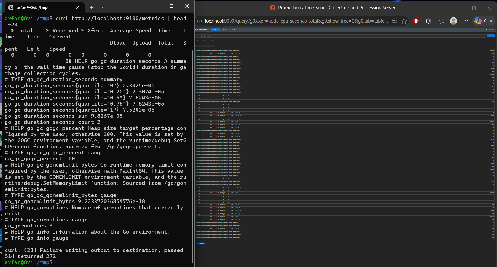
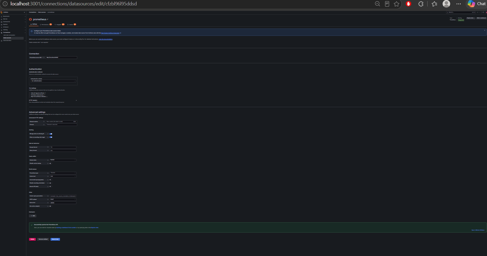
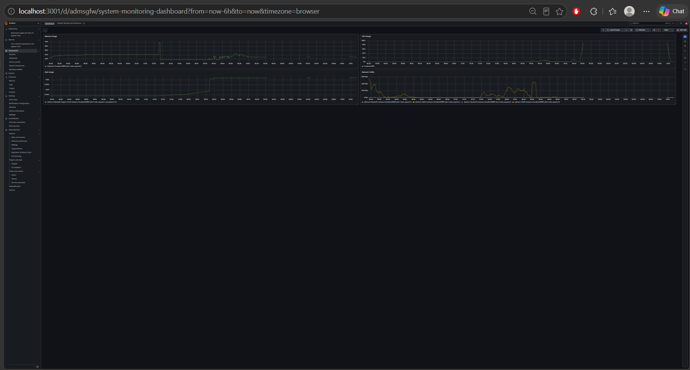
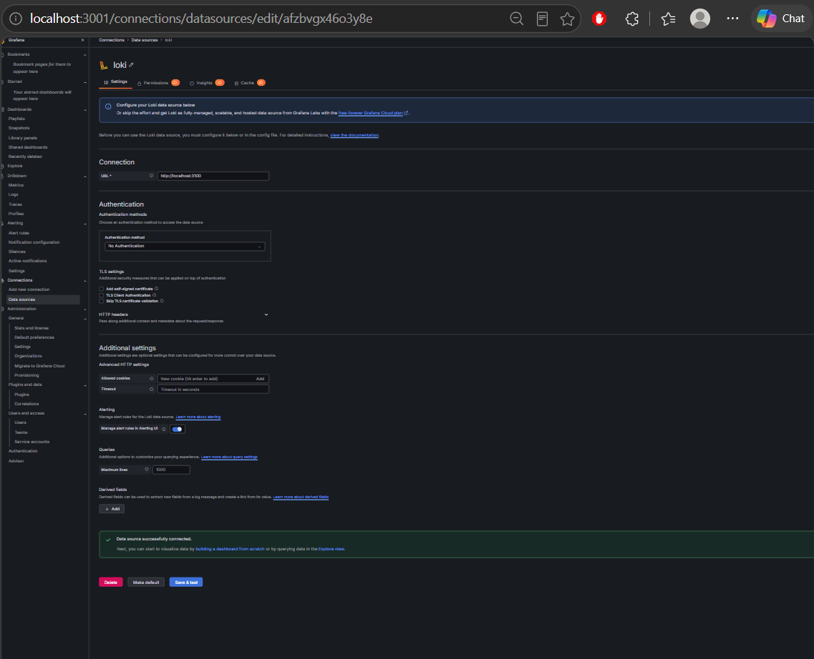
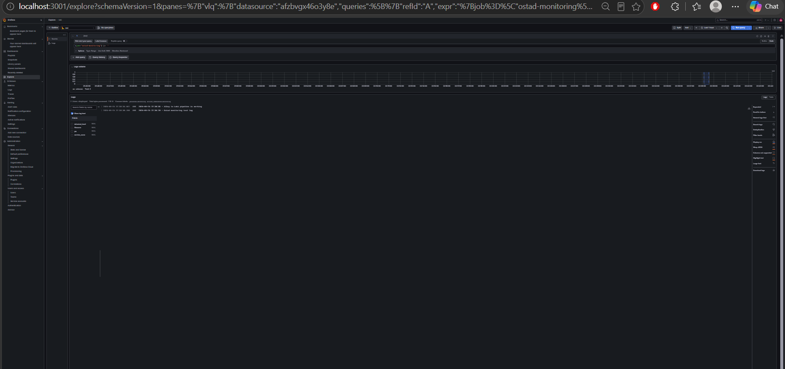
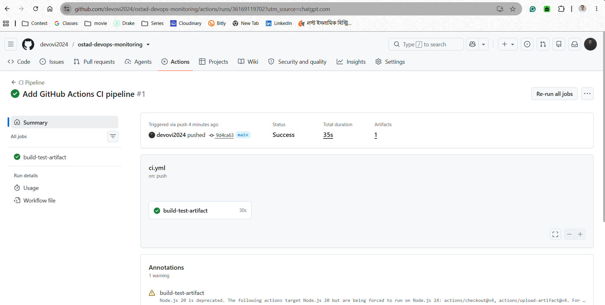

# Ostad DevOps Monitoring

## Student Information

- **Name:** Arfan Ovi
- **Batch:** Ostad DevOps Batch 14
- **Assignment:** Server Monitoring, Logging & CI Pipeline

## Overview

This project implements a DevOps monitoring, logging, visualization, and continuous integration environment on Ubuntu 26.04 LTS.

The environment includes:

- Prometheus for metrics monitoring
- Node Exporter for system metrics
- Grafana for visualization
- Loki for log aggregation
- Grafana Alloy for log shipping
- GitHub Actions with a self-hosted runner
- Build, Test, and Artifact Generation pipeline

## Architecture

```text
                    Ubuntu 26.04 LTS
                           |
          +----------------+----------------+
          |                |                |
          v                v                v
    Node Exporter      Prometheus          Loki
       :9100              :9090            :3100
          |                |                 ^
          |                |                 |
          |                v                 |
          |         Grafana :3001            |
          |                |                 |
          |                +-----------------+
          |
          v
    System Metrics

    Log Source
        |
        v
  Grafana Alloy
        |
        | Log Shipping
        v
     Loki :3100


              GitHub Repository
                     |
                     v
              GitHub Actions
                     |
                     v
             Self-hosted Runner
                     |
          +----------+----------+
          |          |          |
        Build      Test     Artifact
                              |
                              v
                    GitHub Actions Artifact
```

## Components

| Component | Purpose | Port |
|---|---|---:|
| Prometheus | Metrics collection and monitoring | 9090 |
| Node Exporter | Linux system metrics | 9100 |
| Grafana | Metrics and log visualization | 3001 |
| Loki | Log aggregation | 3100 |
| Alloy | Log collection and shipping | - |
| GitHub Actions | CI automation | - |
| Self-hosted Runner | Executes CI jobs | - |

## 1. Prometheus

Prometheus was manually installed and configured as a systemd service.

Configuration:

`prometheus/prometheus.yml`

Prometheus scrapes:

```text
localhost:9090
localhost:9100
```

Health endpoint:

`http://localhost:9090/-/ready`

## 2. Node Exporter

Node Exporter was manually installed and configured as a systemd service.

It exposes system metrics including:

- CPU
- Memory
- Disk
- Network
- Filesystem
- System load

Metrics endpoint:

`http://localhost:9100/metrics`

## 3. Grafana

Grafana was manually installed and configured as a systemd service.

Grafana runs on:

`http://localhost:3001`

Prometheus was configured as a Grafana data source.

### Monitoring Dashboard

The dashboard contains:

- CPU Usage
- Memory Usage
- Disk Usage
- Network Traffic

Dashboard configuration:

`grafana/system-monitoring-dashboard.json`

## 4. Loki and Grafana Alloy

Loki was manually installed and configured as a systemd service.

Loki runs on:

`http://localhost:3100`

Grafana Alloy collects logs from:

`/var/log/ostad-monitoring.log`

and sends them to Loki.

Configuration files:

`loki/config.yml`

`alloy/config.alloy`

Example LogQL query:

```logql
{job="ostad-monitoring"}
```

## 5. GitHub Actions CI

A GitHub Actions workflow was configured to run on a self-hosted Linux runner.

Workflow:

`.github/workflows/ci.yml`

Pipeline:

```text
Checkout
   |
   v
Build
   |
   v
Test
   |
   v
Generate Artifact
   |
   v
Upload Artifact
```

### Build

The build script creates the `dist/` directory and generates the application build output.

`scripts/build.sh`

### Test

The test script verifies the generated build output.

`scripts/test.sh`

### Artifact

The CI pipeline generates `ostad-devops-build.tar.gz` and uploads it as a GitHub Actions artifact.

## 6. Repository Structure

```text
ostad-devops-monitoring/
|
├── .github/
|   └── workflows/
|       └── ci.yml
|
├── alloy/
|   └── config.alloy
|
├── grafana/
|   └── system-monitoring-dashboard.json
|
├── loki/
|   └── config.yml
|
├── prometheus/
|   └── prometheus.yml
|
├── scripts/
|   ├── build.sh
|   └── test.sh
|
├── src/
|   └── index.html
|
├── screenshots/
|
├── .gitignore
└── README.md
```

## 7. Verification

- Prometheus service running
- Node Exporter service running
- Node Exporter target UP in Prometheus
- Node Exporter metrics accessible
- Grafana connected with Prometheus
- Grafana monitoring dashboard working
- Loki service running
- Grafana connected with Loki
- Alloy successfully shipping logs to Loki
- Loki logs visible in Grafana Explore
- GitHub self-hosted runner online
- GitHub Actions CI completed successfully
- Build completed successfully
- Tests passed
- Artifact generated and uploaded

## 8. Screenshots

### 1. Prometheus Node Exporter Target UP



### 2. Prometheus Node Exporter Metrics Query



### 3. Node Exporter Metrics Endpoint



### 4. Grafana Prometheus Data Source



### 5. Grafana Monitoring Dashboard



### 6. Grafana Loki Data Source



### 7. Grafana Loki Logs



### 8. GitHub Self-hosted Runner Online



### 9. GitHub Actions CI Success



### 10. GitHub Actions Artifact


## Result

The monitoring, logging, visualization, and CI environment was successfully implemented on Ubuntu 26.04 LTS.

Prometheus and Node Exporter provide system monitoring, Grafana provides visualization, Loki and Alloy provide centralized log collection, and GitHub Actions provides an automated Build-Test-Artifact CI pipeline using a self-hosted runner.

## Conclusion

This assignment demonstrates a practical DevOps environment combining infrastructure monitoring, log aggregation, visualization, and continuous integration.
